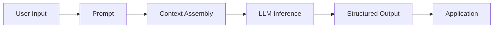

# 🧠 LLM Fundamentals Playground

### Learn LLM fundamentals by building and experimenting.

> A simple interactive playground I built during Phase 1 of my LLM learning journey to understand how tokens, context, prompts, temperature, structured outputs, hallucinations, and streaming work.

`LLM` &nbsp; `Generative AI` &nbsp; `React` &nbsp; `TypeScript` &nbsp; `Learning Project`

---

[🚀 Explore the Experiments](#-what-can-you-explore) &nbsp;•&nbsp; [📖 Learning Journey](#-why-i-built-this) &nbsp;•&nbsp; [🏗️ Architecture Flow](#️-simple-architecture)

---


## ✨ What Can You Explore?

| # | Experiment | What it teaches |
|---|---|---|
| **01** | 🔤 **Token Explorer** | How text is segmented into subword token units |
| **02** | 🧠 **Context Window** | What information an LLM can actually see in memory |
| **03** | ✍️ **Prompt Lab** | How constraints, roles, and format shape responses |
| **04** | 🌡️ **Temperature** | How sampling settings influence response variability |
| **05** | 📦 **Structured Output** | Turning natural language into application-ready JSON |
| **06** | ⚠️ **Hallucination Lab** | Why fluent, confident answers can still be factually wrong |
| **07** | ⚡ **Streaming** | How tokens arrive progressively via server-sent events |
| **08** | 🏗️ **LLM Pipeline** | How the pieces fit together into a software application |

---

## 🎯 Why I Built This

When I started learning LLMs, I noticed that it was easy to understand the definitions but harder to understand what actually happens inside an LLM application.

So instead of only taking notes, I decided to turn the concepts into small interactive experiments.

This project is my way of learning by building.

---

## 🧪 The Experiments

### 01 — Token Explorer

Explore how text can be divided into smaller token units before being processed by a language model.

```text
"Large Language Models"

        ↓

"Large" | " Language" | " Models"
```

LLMs do not process whole sentences or letters directly—they read sequences of integer token identifiers. This experiment visually segments text in real time to show subword splits and whitespace preservation.

---

### 02 — Context Window

Understand how system instructions, conversation history, retrieved information, and the current question become part of the model's context.

```text
System instructions
       ↓
Conversation history
       ↓
Retrieved information (RAG)
       ↓
Current question
       ↓
      LLM
```

The model has zero memory outside the active context window. An interactive meter demonstrates how prompt accumulation uses up available space and why attention degrades when the window approaches its limit.

---

### 03 — Prompt Lab

Compare vague prompts with clearer prompts and see how instructions, constraints, and formatting can influence responses.

```text
❌ Tell me about AI.

        VS

✅ Explain AI to a second-year CS student
   in 5 simple bullet points.
```

Prompt engineering is essentially software specification: setting roles, output bounds, and negative constraints directly eliminates conversational filler and ambiguous outputs.

---

### 04 — Temperature & Sampling

Experiment with temperature and observe how changing sampling settings can influence response variability.

Temperature acts as a mathematical divisor on the raw output logits before the Softmax function is applied:

* **Low temperature ($T \approx 0.1$):** Sharpens probabilities. Selects the most likely next tokens (greedy argmax). Yields consistent, predictable answers.
* **Medium temperature ($T \approx 0.7$):** Balanced distribution. The default for conversational assistants.
* **High temperature ($T \ge 1.2$):** Flattens the probability curve. Low-probability tokens have a higher chance of being picked, introducing variance and creativity at the cost of coherence.

---

### 05 — Structured Output

See how natural language turns into reliable, typed data structures:

```text
Natural Language
       ↓
      LLM
       ↓
     JSON
```

```json
{
  "name": "Rahul",
  "branch": "CSE",
  "year": 2,
  "skills": ["Java", "Python", "AI"]
}
```

Without structured outputs, connecting an LLM to an application requires fragile regex parsing. Constrained JSON decoding ensures downstream databases and APIs receive valid, type-safe data every time.

---

### 06 — Hallucination Lab

```text
Question
   ↓
LLM
   ↓
Answer
   ↓
Check Evidence
```

> **One of the biggest lessons from this phase was that a confident answer is not automatically a correct answer.**

Language models are optimized for syntactic fluency and next-token probability, not factual truth. When asked about a fictional company:
* **Without context:** The model generates plausible-sounding co-founders with high confidence—a complete fabrication.
* **With grounded context:** The model extracts the verified founder directly from the provided source document with verifiable citations.

---

### 07 — Streaming

Instead of waiting for the entire response to finish generating on the server, streaming allows output to appear progressively token by token:

```text
AI
AI agents
AI agents can
AI agents can use
AI agents can use tools
```

Using Server-Sent Events (SSE), Time to First Token (TTFT) drops to ~240ms, making conversational interfaces feel fast and responsive.

---

## 🏗️ Simple Architecture



Modern LLM applications are not just a single prompt call—they are pipelines. This playground demonstrates and isolates each step in that sequence.

---

## 🛠️ Tech Stack

| Technology | Used for |
|---|---|
| **React 19** | User interface & reactive state |
| **TypeScript** | Type safety across token and prompt schemas |
| **Vite** | Fast local development and production bundling |
| **Tailwind CSS** | Clean, minimalist light-theme styling |
| **Framer Motion** | Subtle UI transitions |
| **Lucide React** | Clean, lightweight icons |

*Note: The playground runs completely client-side using deterministic simulation models and local BPE tokenization—no external paid API keys or subscriptions required to explore.*

---

## 📁 Project Structure

```text
llm-fundamentals/
├── index.html
├── package.json
├── tailwind.config.js
├── tsconfig.json
├── vite.config.ts
└── src/
    ├── App.tsx
    ├── main.tsx
    ├── index.css
    ├── components/
    │   └── Topbar.tsx
    ├── data/
    │   ├── architectureNodes.ts
    │   └── sampleData.ts
    ├── pages/
    │   ├── Overview.tsx
    │   ├── TokenExplorer.tsx
    │   ├── ContextWindow.tsx
    │   ├── PromptLab.tsx
    │   ├── TemperatureLab.tsx
    │   ├── StructuredOutput.tsx
    │   ├── HallucinationLab.tsx
    │   ├── Streaming.tsx
    │   └── Architecture.tsx
    ├── types/
    │   └── index.ts
    └── utils/
        └── tokenizer.ts
```

---

## 🚀 Run Locally

Prerequisites: [Node.js](https://nodejs.org/) (version 18 or newer).

```bash
# 1. Clone the repository
git clone https://github.com/your-username/llm-fundamentals.git

# 2. Enter the project folder
cd llm-fundamentals

# 3. Install dependencies
npm install

# 4. Start the local development server
npm run dev
```

Open `http://localhost:5173/` in your browser.

---

## 📸 Preview

> Screenshots coming soon.

---

## 💡 Key Takeaways

* **Tokens, not words:** LLMs process discrete subword token sequences, which affects pricing, context limits, and language performance.
* **Context is working memory:** The model only knows what is provided in the active context window.
* **Prompt structure matters:** Defining personas, constraints, and target formatting turns probabilistic text into predictable outputs.
* **Sampling parameters shape behavior:** Temperature directly scales the logit probability distribution before token selection.
* **Structured outputs enable software integration:** Enforcing JSON schemas allows LLMs to interact with databases and APIs.
* **Confidence $\neq$ Correctness:** High linguistic fluency does not guarantee factual accuracy; external grounding and citations are essential.
* **Building beats reading:** Building interactive experiments helped me understand the concepts much better than reading alone.

---

## 📚 Phase 1 Learning Map

```text
Phase 0 — Foundations (Python, APIs, Math)
   ↓
Phase 1 — LLM Fundamentals ✓ (This Project)
   ↓
Phase 2 — Tool Calling & Function Execution
   ↓
Phase 3 — Retrieval-Augmented Generation (RAG)
   ↓
Phase 4 — Autonomous Agents & Multi-turn Loops
   ↓
Phase 5 — Evaluation, Guardrails & Production AI
```

> *This project represents my Phase 1 milestone.*

---

## 🔭 What's Next?

### Phase 2 — Tool Calling

Next, I want to transition from:

```text
LLM
 ↓
Generate an answer
```

to:

```text
LLM
 ↓
Choose a tool
 ↓
Execute an action
 ↓
Use the result
 ↓
Generate a verified answer
```

The next project will explore function schemas, structured tool execution, and combining retrieval with action loops.

---

## 👨‍💻 Learning in Public 🚀

> This project is part of my journey toward understanding and building AI applications.
>
> I'm learning by building small systems, breaking concepts down, and documenting what I discover along the way.

**Phase 1 → LLM Fundamentals ✅**  
**Next → Tool Calling**
